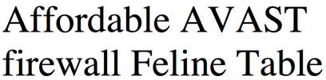

## What is LaTeX?

- LaTeX is a system for making nicely typeset documents.
- It separates the actual content from the layout
    - you write the text THEN typeset to format it
    - *c.f.* WYSIWYG editors like MS Word

## Why Choose LaTeX?

- The output looks great -- more professional than MS office
    - Text is formatted as a whole, rather than as individual characters

## Why Choose LaTeX? 

LaTeX:

Word: 


## Why Choose LaTeX? 
- You can focus on the actual writing, rather than the formatting
- When you DO come to do the formatting, it's easy to RELIABLY make global changes

## Other great things about LaTeX
- You can get a lot of control with little effort
- It's independent of your computer’s platform -- you can open tex files on any system AND it’s free.
    - Free as in speech and free as in beer
    
## Other great things about LaTeX
- Archival.
    - Your document should still compile in 50 years time.  
    - In the worst case, source is plain text
    - TeX was originally written in 1978, original TeX documents still compile perfectly.
    - Is this the case with Word 97?  Wordstar?  Lotus Notes?

## Other great things about LaTeX

- The output is trustworthy and consistent
    - You won't get random changes of font
    - When you change the document settings, it changes them everywhere
        - So it won't matter if you forget to select say your figure captions
- You can automatically create your table of contents AND have it link to the right parts of your document

## Other great things about LaTeX

- Numbering is done automatically
    - You can shuffle around pieces of your document without worrying about the order
    - Things that update automatically:
        - section/chapter numbering/TOC
        - Figures/tables/schemes (also known as "floats")
        - Equations and compounds -- you can even get automatic numbering to happen WITHIN your images


## Other great things about LaTeX

- It's very easy to make shortcuts (also known as macros) e.g.
    - accented text: ```\maori``` to produce m&#257;ori
    - long words: ```\rimu``` to produce *dacrydium cupressinum*
    - formatted text: ```\oneJPtP``` to produce <sup>1</sup>*J*<sub>Pt-P</sub>

## Other great things about LaTeX

- A new line doesn't mean a new paragraph, which is really great for lists of data
- You can choose how involved in the document set up you get
    - You can stick to the basics, and it will look great
    - OR you can get really involved in styles and formatting control -- there are many fancy things you can do!
- It handles large documents very well (and you don't have to typeset the whole thing every time)
  
## Common complaints about LaTeX 
### (and why they're wrong)

- You have to learn how to code
    - Not really.  There are a few commands that you have to use, but they're more like keyboard shortcuts (e.g. ctrl+B for bold) than proper coding
- There's a steep learning curve
    - Word also has a steep learning curve for anything more than the basics
    - The pay off is definitely worth it!
